目录

[TOC]

# 0 IP核的位置

点击左侧的 IP Catalog，右侧会出现完整的IP目录。

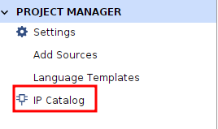

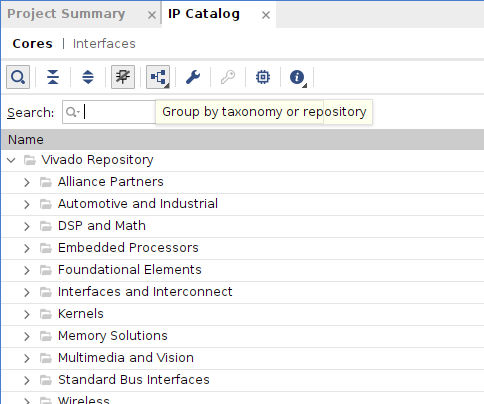

# 1 IP软核的参数

## 1.1 固有参数

综合参数：

选择左侧的Settings,再在弹出的界面中选择左侧的Synthesis,可以在右侧看到一系列的综合参数。这些参数是所有IP核共享的。

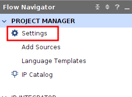

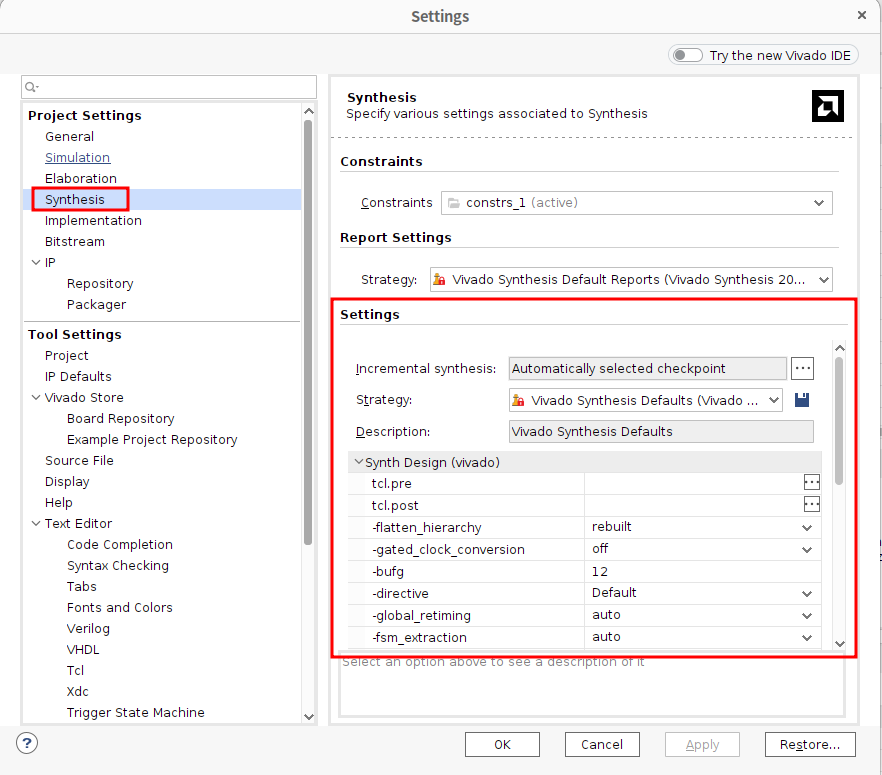

## 1.2 自己特色的参数

我们在IP Catalog中双击选中一个IP核（以`Multiplier`为例），会出现IP核的配置界面。在这里可以定制所需规格的IP核，当然不同的IP核定制时的参数是不同的。

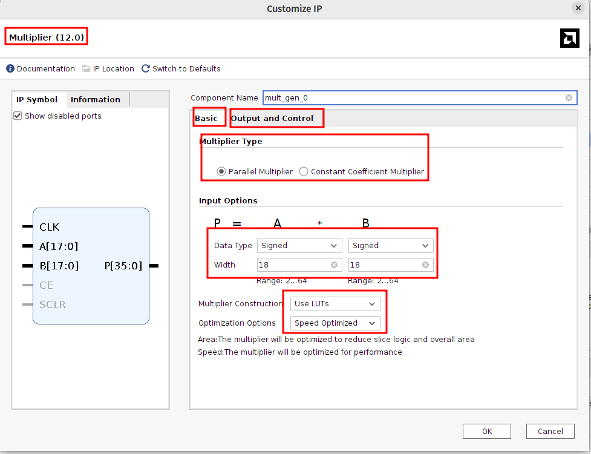

# 2 多个IP如何联动？

## 2.1 方法1：手动使用图形化界面Block Design

点击左侧的IP INTEGRATOR的Create Block Design，然后就可以在右侧的Diagram中手动添加IP核以及连线，保存就会自动生成设计文件（`design.bd`）。

这里的示例是：两个常量IP核（`Constant`）经过一个乘法器IP核（`Multiplier`），得到最终的输出result。

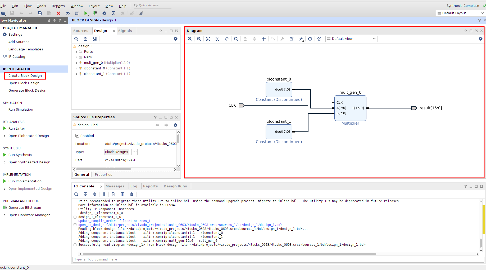

之后再执行Generate Output Products、Create HDL Wrapper，就会得到顶层设计文件（`design_wrapper.v`）。接着就可以运行综合（Run Synthesis）了。

## 2.2 方法2：在 RTL 顶层文件中手动例化多个 IP

通过 RTL 顶层文件手动例化多个 IP 核。（注意：`Constant IP`只能用于Block Design中，所以我们换个例子）

我打算实现`result = (A + B) × (A - B)`，就有两个`Adder/Subtracter  IP`、一个`Multiplier Generator IP`。

先添加三个IP。

| IP 名称      | 功能   | 关键配置                                                     |
| ------------ | ------ | ------------------------------------------------------------ |
| `c_addsub_0` | 加法器 | Signed，A Width=16，B Width=16，Output Width=17，Latency=0   |
| `c_addsub_1` | 减法器 | Signed，A Width=16，B Width=16，Output Width=17，Latency=0   |
| `mult_gen_0` | 乘法器 | Signed，A Width=17，B Width=17，P Width=34，Pipeline Stages=1 |

然后新建 RTL 顶层文件（PROJECT MANAGER → Add Sources→Add or create design sources→Create File→top_ip_chain（Verilog）），写顶层 RTL 文件。例如：

```verilog
`timescale 1ns / 1ps

module top_ip_chain(
    input clk,
    input  signed [15:0] A,
    input  signed [15:0] B,
    output signed [16:0] sum,
    output signed [16:0] diff,
    output signed [33:0] result
);

    c_addsub_0 u_add (
        .A(A),
        .B(B),
        .S(sum)
    );

    c_addsub_1 u_sub (
        .A(A),
        .B(B),
        .S(diff)
    );

    mult_gen_0 u_mult (
        .CLK(clk),
        .A(sum),
        .B(diff),
        .P(result)
    );

endmodule
```

保存 `top_ip_chain.v` 后，右键选择Set as Top。

自己写 testbench 测试（PROJECT MANAGER → Add Sources →  Add or create simulation sources→  Create File→ tb_top_ip_chain（Verilog））。

```verilog
`timescale 1ns / 1ps

module tb_top_ip_chain;

    reg clk;
    reg signed [15:0] A;
    reg signed [15:0] B;

    wire signed [16:0] sum;
    wire signed [16:0] diff;
    wire signed [33:0] result;

    // 实例化顶层设计
    top_ip_chain uut (
        .clk(clk),
        .A(A),
        .B(B),
        .sum(sum),
        .diff(diff),
        .result(result)
    );

    // 100 MHz 时钟，周期 10 ns
    always #5 clk = ~clk;

    initial begin
        clk = 0;
        A = 16'sd0;
        B = 16'sd0;

        // 等待系统稳定
        repeat (5) @(posedge clk);

        // 测试 1：A = 10, B = 3
        // sum = 13, diff = 7, result = 91
        run_test(16'sd10, 16'sd3, 17'sd13, 17'sd7, 34'sd91);

        // 测试 2：A = 20, B = 5
        // sum = 25, diff = 15, result = 375
        run_test(16'sd20, 16'sd5, 17'sd25, 17'sd15, 34'sd375);

        // 测试 3：A = 3, B = 10
        // sum = 13, diff = -7, result = -91
        run_test(16'sd3, 16'sd10, 17'sd13, -17'sd7, -34'sd91);

        // 测试 4：A = -8, B = 2
        // sum = -6, diff = -10, result = 60
        run_test(-16'sd8, 16'sd2, -17'sd6, -17'sd10, 34'sd60);

        #50;
        $finish;
    end

    task run_test;
        input signed [15:0] test_A;
        input signed [15:0] test_B;
        input signed [16:0] expected_sum;
        input signed [16:0] expected_diff;
        input signed [33:0] expected_result;
        begin
            @(posedge clk);
            A <= test_A;
            B <= test_B;

            // Multiplier 有 1 级流水线，这里多等几个周期，保证结果稳定
            repeat (5) @(posedge clk);

            $display("----------------------------------------");
            $display("A      = %0d", A);
            $display("B      = %0d", B);
            $display("sum    = %0d, expected = %0d", sum, expected_sum);
            $display("diff   = %0d, expected = %0d", diff, expected_diff);
            $display("result = %0d, expected = %0d", result, expected_result);

            if (sum === expected_sum &&
                diff === expected_diff &&
                result === expected_result) begin
                $display("TEST PASSED");
            end else begin
                $display("TEST FAILED");
            end
        end
    endtask

endmodule
```

保存 `tb_top_ip_chain.v`，右键选择 **Set as Top**。

然后运行仿真： **SIMULATION → Run Simulation → Run Behavioral Simulation**。

## 2.3 方法3：用 Tcl 脚本自动创建 Block Design

Tcl 脚本方式与图形化 Block Design 的目标相同，都是创建 IP 连接关系。区别在于，图形化方式通过鼠标拖拽和连线完成，而 Tcl 脚本方式通过命令自动完成。需要注意的是，Ubuntu 终端只用于创建和编辑 `.tcl` 脚本文件，真正执行脚本的位置是 Vivado 的 Tcl Console。

1. 新建Vivado 工程：project_tcl

2. 在 Ubuntu 中创建 Tcl 脚本文件。Ubuntu 终端执行：`gedit /data/projects/vivado_projects/project_2/create_ip_chain_bd.tcl `这个命令会打开 gedit 文本编辑器。然后你在 gedit 里粘贴 以下Tcl 脚本内容，保存。

```tcl
# ============================================================
# Create Block Design by Tcl
# Function: result = (A + B) * (A - B)
# A = 10, B = 3
# Expected result = 91
# ============================================================

# 1. Create a new block design
create_bd_design "design_tcl"
current_bd_design [get_bd_designs design_tcl]

# 2. Add Constant IPs
create_bd_cell -type ip -vlnv xilinx.com:ip:xlconstant:1.1 const_a
create_bd_cell -type ip -vlnv xilinx.com:ip:xlconstant:1.1 const_b

# Configure Constant IPs
set_property -dict [list CONFIG.CONST_WIDTH {16} CONFIG.CONST_VAL {10}] [get_bd_cells const_a]
set_property -dict [list CONFIG.CONST_WIDTH {16} CONFIG.CONST_VAL {3}]  [get_bd_cells const_b]

# 3. Add Adder/Subtracter IPs
create_bd_cell -type ip -vlnv xilinx.com:ip:c_addsub:12.0 add_ip
create_bd_cell -type ip -vlnv xilinx.com:ip:c_addsub:12.0 sub_ip

# Configure add_ip: sum = A + B
set_property -dict [list \
    CONFIG.A_Type {Signed} \
    CONFIG.A_Width {16} \
    CONFIG.B_Type {Signed} \
    CONFIG.B_Width {16} \
    CONFIG.Add_Mode {Add} \
    CONFIG.Out_Width {17} \
    CONFIG.Latency {0} \
] [get_bd_cells add_ip]

# Configure sub_ip: diff = A - B
set_property -dict [list \
    CONFIG.A_Type {Signed} \
    CONFIG.A_Width {16} \
    CONFIG.B_Type {Signed} \
    CONFIG.B_Width {16} \
    CONFIG.Add_Mode {Subtract} \
    CONFIG.Out_Width {17} \
    CONFIG.Latency {0} \
] [get_bd_cells sub_ip]

# 4. Add Multiplier IP
create_bd_cell -type ip -vlnv xilinx.com:ip:mult_gen:12.0 mult_ip

# Configure mult_ip: 17-bit signed * 17-bit signed = 34-bit signed
set_property -dict [list \
    CONFIG.PortAType {Signed} \
    CONFIG.PortAWidth {17} \
    CONFIG.PortBType {Signed} \
    CONFIG.PortBWidth {17} \
    CONFIG.OutputWidthHigh {33} \
    CONFIG.OutputWidthLow {0} \
    CONFIG.PipeStages {1} \
] [get_bd_cells mult_ip]

# 5. Create clock port for multiplier
create_bd_port -dir I -type clk clk
set_property CONFIG.FREQ_HZ 100000000 [get_bd_ports clk]
connect_bd_net [get_bd_ports clk] [get_bd_pins mult_ip/CLK]

# 6. Connect Constant IPs to add/sub IPs
connect_bd_net [get_bd_pins const_a/dout] [get_bd_pins add_ip/A]
connect_bd_net [get_bd_pins const_b/dout] [get_bd_pins add_ip/B]

connect_bd_net [get_bd_pins const_a/dout] [get_bd_pins sub_ip/A]
connect_bd_net [get_bd_pins const_b/dout] [get_bd_pins sub_ip/B]

# 7. Connect add/sub outputs to multiplier inputs
connect_bd_net [get_bd_pins add_ip/S] [get_bd_pins mult_ip/A]
connect_bd_net [get_bd_pins sub_ip/S] [get_bd_pins mult_ip/B]

# 8. Make multiplier output external
make_bd_pins_external [get_bd_pins mult_ip/P]
set_property name result [get_bd_ports P_0]

# 9. Validate and save design
validate_bd_design
save_bd_design

# 10. Layout
regenerate_bd_layout

puts "Block Design design_tcl has been created successfully."
```

3. 在 Vivado 的 Tcl Console 里输入：`source /data/projects/vivado_projects/project_2/create_ip_chain_bd.tcl`然后回车。如下图所示，会自动生成bd文件。

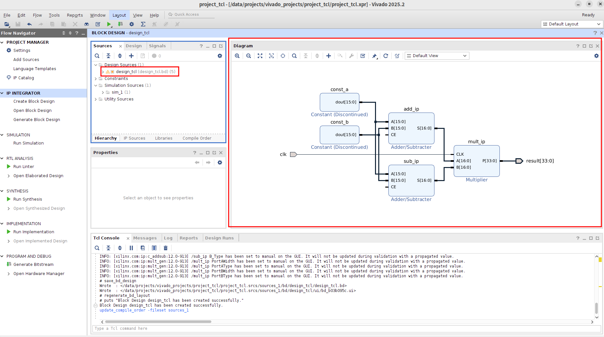


# 3 如何将已有的IP插入已有的代码中？


## 3.1  方法1：在 RTL 代码中直接例化 IP

对于接口较简单的 Vivado 自带软 IP，可以直接在已有 Verilog/VHDL 代码中例化该 IP。基本流程为：先在 IP Catalog 中定制 IP，执行 Generate Output Products，随后查看 Vivado 生成的 IP 例化模板，例如 `.veo` 文件或 Open IP Instantiation Template。然后在已有 RTL 模块中按照模板例化 IP，并连接时钟、复位和数据端口。

流程可参考参考2.2。

## 3.2 方法2：把 Block Design 生成的 Wrapper 插入已有代码

如果 IP 比较多，或者涉及 AXI、时钟、复位、地址映射，通常会先用 Block Design 搭好系统，再生成 HDL Wrapper。

例如 Vivado 生成了：`design_wrapper.v`

那么已有代码里可以这样调用：

```verilog
module my_top(
    input clk,
    output [33:0] result
);

    design_wrapper u_design (
        .clk(clk),
        .result(result)
    );

endmodule
```

# 4 testbench能不能改？能。

分两种情况介绍：

## 4.1 当前工程中默认不直接生成可运行 Testbench 的情况（以 FIFO Generator 为例）

定制了IP核后，执行Generate Output Products。

### 4.1.1 方法1：使用示例工程（IP Example Design ）。

找到` FIFO IP`（`fifo_generator_0 (fifo_generator_0.xci)`），右键执行Open IP Example Design，会自动创建一个示例工程。 在这里，有Vivado 自动生成的仿真测试文件（`fifo_generator_0_tb`），可以直接修改自动生成的 `fifo_generator_0_tb`。

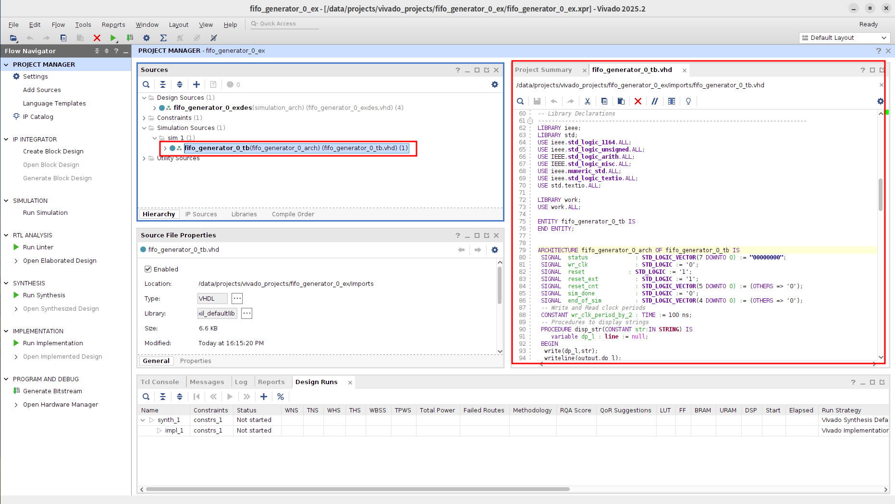

直接执行Run Simulation → Run Behavioral Simulation运行测试。

### 4.1.2 方法2：在当前工程自己写 testbench 测试。

添加仿真源文件。Add Sources → Add or create simulation sources → Create File。

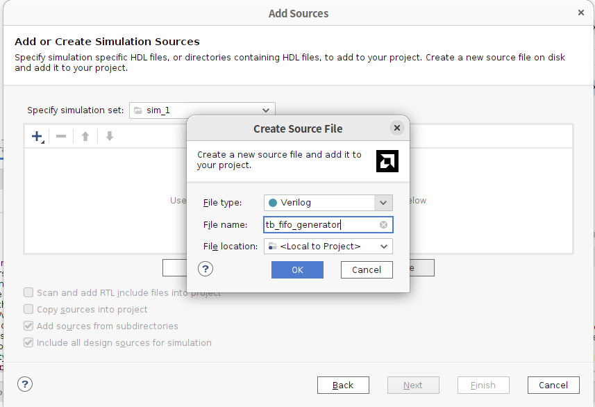

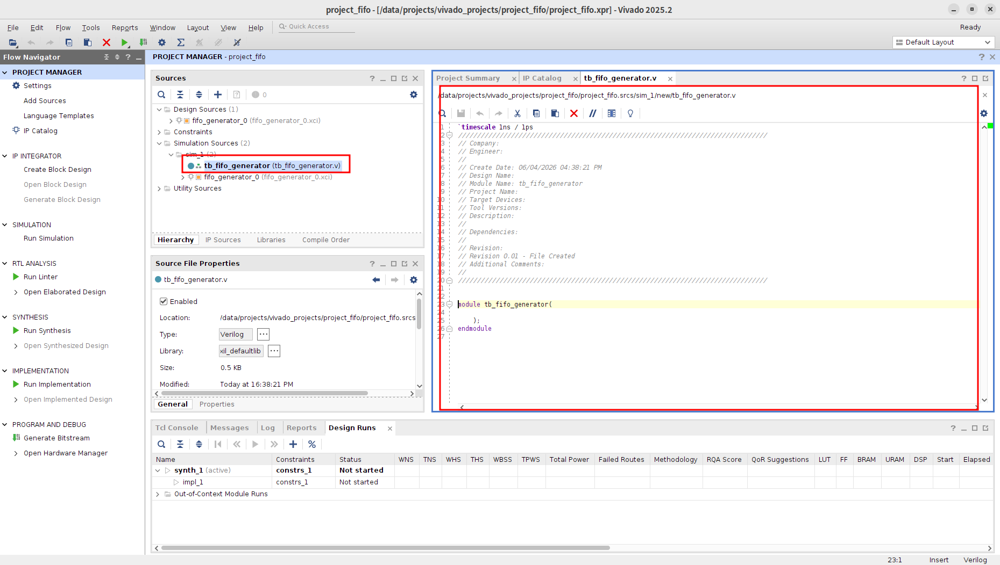

它现在只是一个空的 testbench 模板，需要把里面内容全部替换成完整 testbench。把当前文件内容全部删掉，替换成下面代码：

```verilog
`timescale 1ns / 1ps

module tb_fifo_generator;

    reg clk;
    reg srst;
    reg [7:0] din;
    reg wr_en;
    reg rd_en;

    wire [7:0] dout;
    wire full;
    wire empty;

    // 实例化 FIFO IP
    fifo_generator_0 uut (
        .clk(clk),
        .srst(srst),
        .din(din),
        .wr_en(wr_en),
        .rd_en(rd_en),
        .dout(dout),
        .full(full),
        .empty(empty)
    );

    // 100 MHz 时钟，周期 10 ns
    always #5 clk = ~clk;

    initial begin
        clk   = 0;
        srst  = 1;
        din   = 8'h00;
        wr_en = 0;
        rd_en = 0;

        // 复位
        #50;
        srst = 0;

        #20;

        // 写入 5 个数据
        write_fifo(8'h11);
        write_fifo(8'h22);
        write_fifo(8'h33);
        write_fifo(8'h44);
        write_fifo(8'h55);

        #50;

        // 读出 5 个数据
        read_fifo();
        read_fifo();
        read_fifo();
        read_fifo();
        read_fifo();

        #100;
        $finish;
    end

    // 写 FIFO 任务
    task write_fifo;
        input [7:0] data;
        begin
            @(negedge clk);
            if (!full) begin
                din   = data;
                wr_en = 1'b1;
            end

            @(negedge clk);
            wr_en = 1'b0;
            din   = 8'h00;
        end
    endtask

    // 读 FIFO 任务
    task read_fifo;
        begin
            @(negedge clk);
            if (!empty) begin
                rd_en = 1'b1;
            end

            @(negedge clk);
            rd_en = 1'b0;

            // Standard FIFO 有 1 个时钟周期读延迟
            @(negedge clk);
            $display("Read data = %h, time = %0t", dout, $time);
        end
    endtask

endmodule
```

保存文件，并设置为顶层（右键，选择Set as Top）。

然后运行仿真：SIMULATION → Run Simulation → Run Behavioral Simulation。

## 4.2 IP核自带Testbench文件（以Divider Generator为例）。

定制了IP核后，执行Generate Output Products。

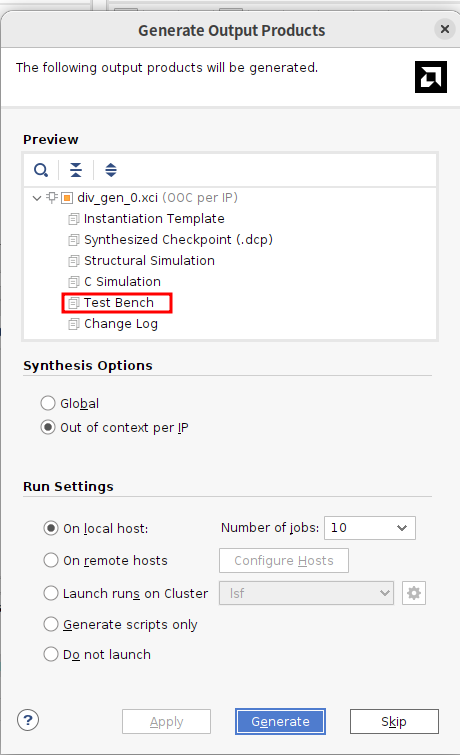


与 FIFO Generator 不同，Divider Generator 在 Generate Output Products 时可以生成 Test Bench 文件，并将 `tb_div_gen_0.vhd` 加入仿真源文件中。因此可以直接将该 testbench 设置为仿真顶层并运行行为级仿真。

### 4.2.1 方法1：使用自带Testbench测试。

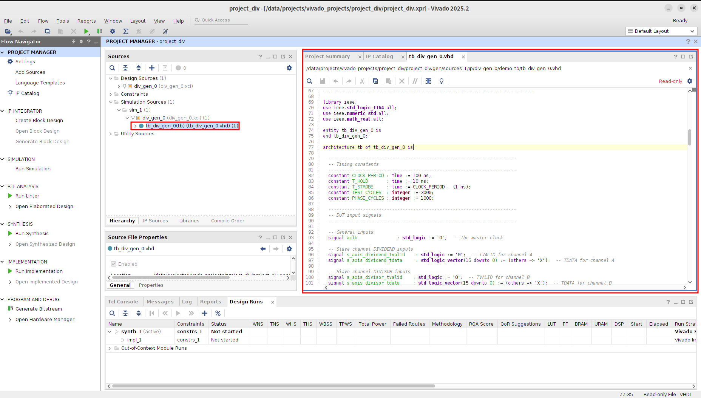

右键`tb_div_gen_0` 选择Set as Top，然后运行仿真：SIMULATION → Run Simulation → Run Behavioral Simulation。

这个自带的 `tb_div_gen_0.vhd` 也可以修改。实际使用中不建议直接修改 Vivado 自动生成的原始 testbench。更稳妥的做法是复制一份 testbench，改名后加入 Simulation Sources，再进行修改。这样可以避免重新生成 IP 输出文件时覆盖用户修改。

### 4.2.2方法2：在当前工程自己写 testbench 测试。

方法同4.1.2。

